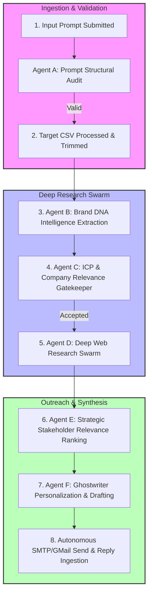

# 🧠 AI-PRIORI | Autonomous Outreach Intelligence Engine (Backend)

<div align="center">
  
  
  
  
  
</div>

---

## 📖 Overview

The **AI-PRIORI Backend** is the core distributed intelligence engine powering an autonomous, high-fidelity B2B company outreach platform. It is engineered to ingest raw target spreadsheets, mobilize deep research swarms, rank strategic stakeholders, personalize high-converting drafts, and manage dispatch/follow-up lifecycles dynamically.

This repository runs a fully decoupled, production-grade architecture combining **FastAPI web gateway API services**, **asynchronous Celery background workers**, and **Celery Beat schedulers** linked by Upstash Redis and Neon PostgreSQL database layers.

---

## 🏗️ System Architecture & Workflow Pipeline

The engine leverages a robust **6-Stage Agentic State Machine** that coordinates and tracks a campaign's state transition seamlessly:



---

## 🛠️ Tech Stack & Systems

* **API Gateway & Routing**: FastAPI, Uvicorn, JSON Web Tokens (JWT) Session Security, AES-256 Stateless Token Encryption.
* **Distributed Task Queue**: Celery (queuing tasks on `heavy_research`, `outbound_dispatch`, `inbox_polling`, and `orchestrator` channels).
* **Database & ORM**: PostgreSQL, Neon DB Serverless, SQLAlchemy ORM, Alembic migrations.
* **Cache & Memory Broker**: Redis (for active session locks, rate limiting, and request caching).
* **AI & LLM Services**: LangChain, OpenAI API (`gpt-4o-mini`), Tavily Search API.

---

## 🔒 Security & Cost Governance

To ensure enterprise stability and budget predictability, this backend implements three core operational frameworks:

### 1. Database-Level Idempotency Guarantees
* Strict unique constraints enforced on:
  * **Target Companies** on `(campaign_id, domain)`
  * **Decision Makers** on `(campaign_id, email)`
  * **Email Drafts** on `(decision_maker_id, followup_index)`
* Built-in check-and-upsert layers in `stage_5_stakeholder_ranking` and `_save_drafts_batch` to completely prevent unique violation crashes during task retries.

### 2. Upstream AI Cost Governance & Caching
* Centralized LLM execution wrapped in `run_openai_guarded()` inside `app/core/llm_resilience.py`.
* **Fuzzy Request Caching**: Hashes prompt closure contexts using SHA-256 and caches raw response objects in Redis to save 100% of the cost on redundant tasks.
* **Daily USD Spending Quota**: Enforces a strict day cap (`LLM_DAILY_BUDGET_USD` defaulting to `$10.00`) and instantly intercepts/blocks calls once the daily threshold is met.

### 3. Production Observability
* Exposes standard Prometheus text metrics at `/api/health/prometheus` for seamless Grafana dashboard configurations.
* Global Celery signal handlers (`@task_failure.connect`) dispatch immediate slack notifications for operational task failures.

---

## 📂 Backend Directory Structure

```text
backend/
├── app/
│   ├── agents/             # Agentic AI prompt controllers & langchain chains
│   ├── api/                # FastAPI routers (auth, campaigns, prospects, health)
│   ├── core/               # Circuit breaker, logging filters, cost governance, security
│   ├── db/                 # Modular schemas and database models (SQLAlchemy)
│   ├── integrations/       # External gateways (Gmail OAuth2, Cal.com API)
│   ├── services/           # Ingestion pipelines, company validation, stakeholder ranking
│   └── workers/            # Celery configurations, tasks, and utility functions
├── migrations/             # Database tables schema upgrade versions (Alembic)
├── tests/                  # Integrity test suites
├── .env.example            # Environment configuration blueprints
├── Dockerfile              # Container building specifications
└── main.py                 # FastAPI Application Entrance Bootstrapper
```

---

## 🚀 Local Quickstart Guide

### Prerequisites
* Python 3.10+
* Redis Server running locally (`redis://localhost:6379`)
* PostgreSQL Database Server (or Neon instance)

### 1. Environment Setup
Clone the repository, navigate into your local folder, and create an isolated virtual environment:
```bash
# Clone
git clone <your-backend-repo-url> backend
cd backend

# Create Virtual Env
python -m venv venv

# Activate (Windows)
venv\Scripts\activate

# Activate (Mac/Linux)
source venv/bin/activate
```

### 2. Dependency Resolution
Install the required packages:
```bash
pip install -r requirements.txt
```

### 3. Configure Local Credentials
Copy the environment blueprint to `.env` and fill in the required api credentials (no placeholders):
```bash
cp .env.example .env
```

### 4. Database Migrations
Initialize database tables using Alembic:
```bash
alembic upgrade head
```

### 5. Launch the FastAPI Gateway Server
Start the Uvicorn web server locally:
```bash
uvicorn main:app --reload --port 8000
```
* Interactive Swagger Docs: [http://localhost:8000/docs](http://localhost:8000/docs)
* Health Status Endpoint: [http://localhost:8000/api/health](http://localhost:8000/api/health)
* Prometheus Telemetry: [http://localhost:8000/api/health/prometheus](http://localhost:8000/api/health/prometheus)

### 6. Spin Up Celery Background Workers
To execute background tasks, run your Celery instances in a separate terminal tab:
```bash
# Launch Orchestration Worker
celery -A app.workers.config.celery_app worker -Q heavy_research,outbound_dispatch,inbox_polling,orchestrator --loglevel=info -P solo
```

To run your Cron schedules (Follow-up sweeps and Inbox checks), launch the Beat scheduler:
```bash
celery -A app.workers.config.celery_app beat --loglevel=info
```

---

<div align="center">
  <p><i>Precision Outreach Intelligence | Enterprise Operations</i></p>
</div>
